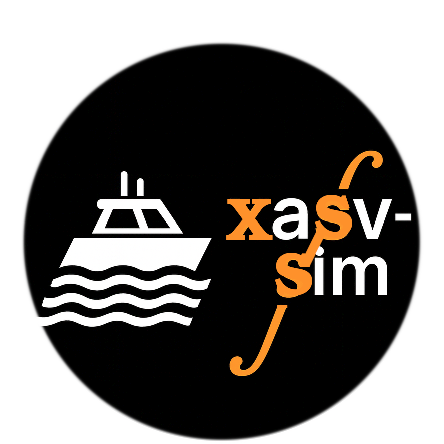

# xasv-simu

<p align="center">
  
</p>

**xasv-simu** is a clean GitHub distribution of the **xasv-sim** stack: a **ROS + ArduPilot + Gazebo** simulation environment for autonomous surface vessels (ASVs) in realistic river scenarios, with support for multiple **X-in-the-Loop** workflows such as **MITL**, **SITL**, **HITL**, **RITL**, and **HuITL**.

This repository contains the reference simulation assets, ROS packages, Gazebo worlds, Blender-based modeling assets, and auxiliary scripts used in our ASV navigation and inspection experiments.

> **Important**  
> This repository was reorganized **without Git LFS**.  
> Large binary assets are stored outside GitHub in a **public Google Drive folder**.

---

## Version

**xasv-sim 1.0.0** is the first complete and stable release of the stack.

This release freezes the core architecture, river worlds, ASV models and X-in-the-Loop workflows used in the associated **SoftwareX** article, so that other groups can reproduce and extend the reported experiments.

This repository, **xasv-simu**, preserves that material while replacing the old Git LFS workflow with an external large-file distribution mechanism.

---

## Features

xasv-simu offers a set of features aimed at realistic simulation and reproducible experiments:

- **Blender-based modeling and export**
  - ASV hulls, sensors and river infrastructures modeled in Blender.
  - Automatic export scripts to generate SDF/URDF/Xacro with simplified collision meshes for real-time simulation.

- **River-inspired Gazebo worlds**
  - Log-boom structures, inspection routes and hydroelectric plant surroundings.
  - Worlds and models organized under `xasv_sim/worlds/` and `xasv_sim/models/`.

- **Full ROS Noetic integration**
  - `xasv_sim` package with custom plugins, launch files, TF tree, topics and configuration for end-to-end experiments.

- **Control allocation utilities**
  - `migbot_allocation/` with ROS and Lua implementations for multi-thruster boats, mapping high-level commands to actuator setpoints.

- **ArduPilot SITL and HITL support**
  - Tight integration with ArduPilot Rover firmware via MAVROS and MAVLink routing.
  - Custom MAVLink messages, scripts and parameter sets for HITL operation with Pixhawk-class boards.

- **X-in-the-Loop workflows**
  - **MITL** – Model-in-the-Loop experiments for algorithm development.
  - **SITL** – Software-in-the-Loop experiments with ArduPilot SITL.
  - **HITL** – Hardware-in-the-Loop with physical flight controllers.
  - **RITL** – Render-in-the-Loop tools to vary appearance while preserving physics.
  - **HuITL** – Human-in-the-Loop tools for teleoperation, supervision and dataset collection.

- **Large-asset-friendly layout**
  - Large binary assets are stored outside GitHub and retrieved separately from a public Google Drive folder.

For a more detailed overview of the proposed architecture, see [docs/ARCHITECTURE.md](docs/ARCHITECTURE.md).

---

## Project structure

At the top level, the repository is organised as follows:

```text
robots/
├── blender/               # Blender sources for the ASV hull and components
├── migbot_description/    # URDF/Xacro description and meshes for the ASV
└── migbot_gazebo/         # Gazebo models, worlds and configuration for the ASV

xasv_sim/
├── data/vehicle/          # Test missions, MLP models and datasets
├── launch/                # Launch files for XITL and MAVROS
├── models/                # World-level models
├── plugins/               # Custom Gazebo world plugins
├── scripts/               # MAVROS and MLP training/evaluation utilities
└── worlds/                # River worlds (e.g., madeira_river.world)

scripts/
├── drive_bigfiles.txt     # List of large files stored outside GitHub
├── download_bigfiles.sh   # Optional helper to fetch large files
└── upload_bigfiles.sh     # Optional helper for maintainers
```

---

## Compatibility and requirements

xasv-sim 1.0.0 has been developed and validated on the following stack:

- **Ubuntu 20.04**
- **ROS Noetic + Gazebo Classic 11**
- **Blender 4.x** (developed with 4.0.1; also tested with Blender 5.0)
- **ArduPilot Rover**
  - **SITL**: compatible with standard ArduPilot Rover releases
  - **HITL**: custom branch derived from Rover-4.0.0

To run the examples and reproduce the experiments, you will also need:

- **MAVProxy** and **QGroundControl** (for SITL/HITL control and monitoring)
- **GeographicLib** geoid datasets for MAVROS (EGM96)
- **PyTorch (torch)** for Python 3 (required by the ML/DRL modules)

Installation references:

- Blender:  
  https://www.blender.org/download/

- ROS 1 Noetic and Gazebo Classic 11 (Ubuntu 20.04):  
  http://wiki.ros.org/noetic/Installation/Ubuntu

- ArduPilot Rover (firmware, source, tools):  
  - SITL case: https://github.com/lmhonorio/ardupilot  
  - HITL case: https://github.com/ttrindader/ardupilot/tree/hitl

- MAVProxy:  
  https://ardupilot.org/mavproxy/

- QGroundControl:  
  https://qgroundcontrol.com/downloads/

- GeographicLib geoid datasets for MAVROS (EGM96):  
  https://github.com/mavlink/mavros/tree/master/mavros#supported-gcs

- PyTorch (torch):  
  https://pytorch.org/get-started/locally/

---

## Installation

### 1) Clone into a catkin workspace

```bash
mkdir -p ~/ros_ws/src
cd ~/ros_ws/src
git clone https://github.com/ttrindader/xasv-simu.git
cd xasv-simu
```

### 2) Download the large binary assets

Large files are not stored in GitHub. Download them from the public Google Drive folder below:

**Public assets folder:**  
https://drive.google.com/drive/folders/1rYY7dQA-xYNVeQeXp-KPBFIzPC7BmF31?usp=sharing

There are two supported ways to install these assets.

#### Option A — Manual download from the public Google Drive folder

Download the files from the public folder and place them in the repository **preserving the exact relative paths below**:

```text
enviroments/blender/SAE_HYDRO_V0/main.blend
enviroments/blender/SAE_HYDRO_V0/main.blend1
xasv_sim/models/SAE_HYDRO_V0/meshes/logboom.dae
```

From the repository root, the final structure must look like this:

```text
xasv-simu/
├── enviroments/
│   └── blender/
│       └── SAE_HYDRO_V0/
│           ├── main.blend
│           └── main.blend1
└── xasv_sim/
    └── models/
        └── SAE_HYDRO_V0/
            └── meshes/
                └── logboom.dae
```

You can verify the installation with:

```bash
ls enviroments/blender/SAE_HYDRO_V0/main.blend
ls enviroments/blender/SAE_HYDRO_V0/main.blend1
ls xasv_sim/models/SAE_HYDRO_V0/meshes/logboom.dae
```

#### Option B — Scripted installation with `rclone`

This is optional and mainly intended for maintainers or advanced users.  
The helper script restores the files directly to the correct locations inside the repository:

```bash
bash scripts/download_bigfiles.sh
```

This script uses the paths listed in:

```text
scripts/drive_bigfiles.txt
```

### 3) Resolve dependencies and build

```bash
cd ~/ros_ws
./src/xasv-simu/install_deps.sh ~/ros_ws
rosdep update
rosdep install --from-paths src --ignore-src -r -y --skip-keys="mavros_msgs"
sudo apt install python3-catkin-tools python3-osrf-pycommon
catkin config --skiplist ardupilot_hitl   # initially, no HITL
catkin build                               # or: catkin_make
echo 'export GAZEBO_MODEL_PATH=${GAZEBO_MODEL_PATH}:~/ros_ws/src/xasv-simu/xasv_sim/models' >> ~/.bashrc
source ~/.bashrc
source ~/ros_ws/devel/setup.bash
```

### 4) Plugin note

Many core functionalities of xasv-simu rely on Gazebo plugins. They fall into two categories:

- Standard plugins provided by ROS/Gazebo
- Vendored/custom plugins versioned under `xasv_sim/plugins` and built together with the workspace

For a detailed overview of all plugins (tables, origin and roles), and for advanced instructions on manually building or installing them, see [docs/PLUGINS.md](docs/PLUGINS.md).

---

## Large files

This repository **does not use Git LFS**.

Large binary assets such as `.blend`, `.blend1`, `.dae`, and other heavy files are distributed separately through a **public Google Drive folder**:

**Public assets folder:**  
https://drive.google.com/drive/folders/1rYY7dQA-xYNVeQeXp-KPBFIzPC7BmF31?usp=sharing

The list of externally stored files is maintained in:

```text
scripts/drive_bigfiles.txt
```

At the moment, the large files are:

```text
enviroments/blender/SAE_HYDRO_V0/main.blend
enviroments/blender/SAE_HYDRO_V0/main.blend1
xasv_sim/models/SAE_HYDRO_V0/meshes/logboom.dae
```

### Optional helper scripts

If you use `rclone`, the repository includes helper scripts:

```bash
bash scripts/download_bigfiles.sh
bash scripts/upload_bigfiles.sh
```

- `download_bigfiles.sh` restores the large files to their correct locations in the repository.
- `upload_bigfiles.sh` uploads or refreshes the same files in the remote storage.

These scripts are mainly intended for maintainers or advanced users.

---

## Google Drive workflow (optional)

This section is optional and mainly intended for maintainers or advanced users.

You do **not** need access to the maintainers' Google account.  
If you want to use the helper scripts, configure your **own local `rclone` remote** and use it to access the public folder workflow.

### Install rclone

Example for Ubuntu/Linux:

```bash
sudo -v ; curl https://rclone.org/install.sh | sudo bash
rclone version
```

### Configure a Google Drive remote

```bash
rclone config
```

Recommended choices:

- New remote: `n`
- Name: choose your own remote name
- Storage: `drive`
- `client_id`: press Enter
- `client_secret`: press Enter
- `scope`: `1`
- `root_folder_id`: press Enter
- `service_account_file`: press Enter
- Advanced config: `n`
- Browser authentication: `y`

After configuration, you may use the scripts by passing the remote explicitly, for example:

```bash
bash scripts/download_bigfiles.sh mydrive:xav-sim
bash scripts/upload_bigfiles.sh mydrive:xav-sim
```

If you prefer, you may also download the files manually from the public Google Drive link and place them at the exact repository paths shown earlier in this README.

---

## Testing

### Perception test

```bash
chmod +x /home/xasvsim/ros_ws/src/ping360_gazebo/ping360_gazebo_plugin/scripts/pcl_gen.py
roslaunch xasv_sim perception_test.launch
```

In the test world, a single ASV robot navigates a river scene while streaming data from its onboard sensors. In RViz, the expected setup includes:

- robot model with grid
- RealSense RGB image
- RealSense depth image
- RealSense point cloud
- Livox lidar point cloud
- Ping360 sonar point cloud

all referenced to `base_link`.

---

## X-in-the-Loop workflows

### MITL (Model-in-the-Loop)

Example mission generation:

```bash
# Mission format (e.g., 'plan' or 'waypoints')
export MISSION_FORMAT="plan"

# Output path for the generated file
export MISSION_OUT="test.plan"

# Default mission altitude (in meters)
export MISSION_ALT="50"

rosrun xasv_sim rosgps2mission.py     --bag "${BAG_NAME}"     --topic "/fix"     --points "${MISSION_POINTS}"     --format "${MISSION_FORMAT}"     --output "${MISSION_OUT}"     --alt "${MISSION_ALT}"
```

One-shot MITL demo:

```bash
./src/xasv-simu/xasv_sim/tests/mitl_test.sh
```

### SITL (Software-in-the-Loop)

In SITL, the full ArduPilot Rover firmware runs as a program on the host, while xasv-simu provides the river world, sensors and actuators via ROS + Gazebo.

```bash
# One-time SITL configuration helper
./src/xasv-simu/ardupilot_sitl/ardupilot_sitl_config.sh

# Simulator with ArduPilot connections
roslaunch xasv_sim xasv_sim.launch world_name:=madeira_river robot_name:=migbot1

# Start ArduPilot Rover SITL (from ArduPilot Rover directory)
./gzboat.sh

# One-shot SITL demo
./src/xasv-simu/xasv_sim/tests/sitl_test.sh
```

### HITL (Hardware-in-the-Loop)

HITL closes the loop with a real flight controller (e.g., Pixhawk 4) running a patched ArduPilot firmware, while xasv-simu still provides the virtual river, sensors and actuator loads.

**Important:** current HITL support in xasv-simu is tied to a specific ArduPilot Rover firmware version (our custom HITL branch). In addition, MAVLink and MAVROS must be installed from source, since HITL in xasv-simu relies on custom Gazebo message definitions that are not provided by prebuilt packages.

Typical HITL session:

```bash
# Gazebo world + robot
roslaunch xasv_sim xasv_sim.launch world_name:=madeira_river robot_name:=migbot1

# MAVProxy (USB -> Pixhawk 4)
mavproxy.py --mav20 --console     --out=127.0.0.1:14550     --out=127.0.0.1:14552     --master=/dev/ttyACM0,115200
```

For the exact branch and commit used in our experiments, see [docs/XITL.md](docs/XITL.md).

---

## Troubleshooting

### Python environment conflicts

**Fix (most stable):** use an isolated environment and avoid mixing with `~/.local`:

```bash
python3 -m venv .venv_xasv
source .venv_xasv/bin/activate
python -m pip install -U pip wheel setuptools
```

If you already mixed environments, inspect the user site-packages:

```bash
python3 -m site --user-site
```

### MAVProxy FTP / logs: `Unable to fetch Log File Size: ENOENT`

This can happen after deleting logs via FTP and then querying a now-missing index or file.

Recommended actions:

- prefer the autopilot-side erase command
- refresh FTP listings and paths

```bash
ftp list /
ftp list /APM/log
```

### Lua scripting errors (API mismatch)

Typical symptom:

- `attempt to call a nil value (global 'Parameter')`

Recommended action:

- use the Lua scripts shipped for the exact firmware branch in use
- do not reuse Lua scripts across unrelated ArduPilot versions without porting

### Gazebo models/plugins not found

1. Ensure model paths are exported:

```bash
echo "$GAZEBO_MODEL_PATH"
```

2. If you updated plugins or messages, do a clean rebuild:

```bash
catkin clean -y
catkin build
source devel/setup.bash
```

### Still stuck?

When opening an issue, include:

- Ubuntu / ROS / Gazebo versions
- whether you are running **MITL / SITL / HITL / RITL / HuITL**
- the exact command you ran
- full terminal output from the failing step

For SITL/HITL problems, also include:

```bash
which ardurover
echo $PATH
```

---

## Contributing

Contributions, issue reports and feature requests are welcome.

- Create feature branches: `git switch -c feature/<short-name>`
- Use clear, descriptive commit messages
- Open pull requests against `main`
- Do **not** add large binary files directly to GitHub
- Keep heavy assets in the public Google Drive workflow and update `scripts/drive_bigfiles.txt` when needed

---

## License

The license for xasv-simu is being finalised.

Until a `LICENSE` file is added at the repository root, please treat this code as **research-only** and contact the maintainers before redistributing or relicensing it.

---

## Citation

If xasv-simu is useful in your research, please cite the associated project and article. A formal citation entry (e.g., BibTeX) will be added here once the corresponding paper is published.

For now, a generic reference such as the following can be used/adapted:

> T. T. Ribeiro et al., "xasv-sim: A ROS + Gazebo X-in-the-Loop stack for autonomous surface vessels in realistic river environments", GitHub repository, accessed YYYY-MM-DD.
